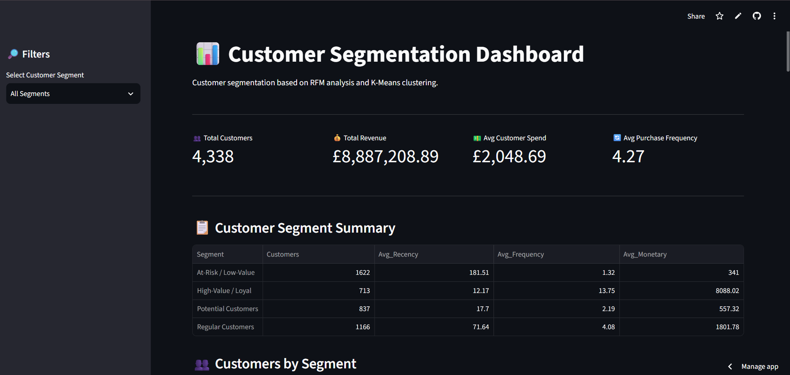

# 📊 Customer Segmentation using RFM Analysis and K-Means

## 📌 Project Overview

This project focuses on customer segmentation using the Online Retail dataset.

The objective is to identify different customer groups based on their purchasing behavior using RFM Analysis and K-Means Clustering.

The project also includes an interactive dashboard built using Streamlit to visualize customer segments and business insights.

## 🎯 Objectives

- Analyze customer purchasing behavior
- Clean and prepare retail transaction data
- Calculate RFM metrics
- Segment customers using K-Means clustering
- Visualize customer segments
- Generate business insights from customer behavior

## 🛠️ Technologies Used

- Python
- Pandas
- NumPy
- Matplotlib
- Scikit-learn
- Streamlit
- Excel Dataset
- VS Code

## 📂 Dataset

The project uses the Online Retail dataset containing transaction-level information such as:

- Invoice Number
- Stock Code
- Product Description
- Quantity
- Invoice Date
- Unit Price
- Customer ID
- Country

## 🧹 Data Cleaning

The following preprocessing steps were performed:

- Removed duplicate transactions
- Removed records with missing Customer IDs
- Removed cancelled invoices
- Removed transactions with negative or zero quantity
- Removed transactions with zero or negative unit prices
- Created a new Revenue column

### Revenue Calculation

Revenue = Quantity × Unit Price

## 📊 RFM Analysis

RFM stands for:

### Recency
How recently a customer made a purchase.

### Frequency
How frequently a customer made purchases.

### Monetary
How much money a customer spent.

These three metrics were calculated for each customer and used to understand customer purchasing behavior.

## 🤖 K-Means Clustering

K-Means clustering was used to divide customers into 4 different segments.

The Elbow Method was used to determine a suitable number of clusters.

The four customer segments identified were:

- High-Value / Loyal Customers
- At-Risk / Low-Value Customers
- Potential Customers
- Regular Customers

## 📈 Results

The analysis identified 4,338 customers across four customer segments.

### Segment Distribution

| Customer Segment | Number of Customers |
|---|---:|
| At-Risk / Low-Value | 1,622 |
| Regular Customers | 1,166 |
| Potential Customers | 837 |
| High-Value / Loyal | 713 |

## 💡 Business Insights

### High-Value / Loyal Customers
These customers purchase frequently and contribute significantly to revenue.

**Business Strategy:** Focus on customer retention, loyalty programs and personalized offers.

### At-Risk / Low-Value Customers
These customers have not purchased recently and show relatively low purchasing activity.

**Business Strategy:** Use targeted campaigns, reminders and re-engagement offers.

### Potential Customers
These customers have purchased recently but have relatively low purchase frequency.

**Business Strategy:** Encourage repeat purchases through personalized recommendations and promotions.

### Regular Customers
These customers show moderate purchasing frequency and spending.

**Business Strategy:** Encourage them to increase purchase frequency and move toward the high-value segment.

## 🖥️ Interactive Dashboard

🔗 **[View Live Dashboard](https://customer-segmentation-z274vfts22ftrqbdfmhas2.streamlit.app/)**

### Dashboard Preview

An interactive Streamlit dashboard was developed to visualize the customer segments and RFM analysis.

The dashboard includes:

- Total Customers
- Total Revenue
- Average Customer Spend
- Average Purchase Frequency
- Customer Segment Summary
- Customer Distribution by Segment
- Revenue by Segment
- Purchase Frequency by Segment
- RFM Analysis
- Segment Filter
- Customer-level Data

## 📁 Project Structure

Customer-Segmentation/
│
├── data/
│   └── Online Retail.xlsx
│
├── output/
│   └── customer_segments.csv
│
├── dashboard/
│   └── app.py
│
├── analysis.py
└── README.md

## ▶️ How to Run the Project

### 1. Install the required libraries

pip install pandas numpy matplotlib scikit-learn openpyxl streamlit

python analysis.py

python -m streamlit run dashboard/app.py 

## 📌 Key Skills Demonstrated

- Data Cleaning
- Exploratory Data Analysis
- Feature Engineering
- RFM Analysis
- K-Means Clustering
- Customer Segmentation
- Data Visualization
- Dashboard Development
- Business Insight Generation
- Python

## 👩‍💻 Author

**Madhura Shinde**

B.Tech Computer Science & Engineering
